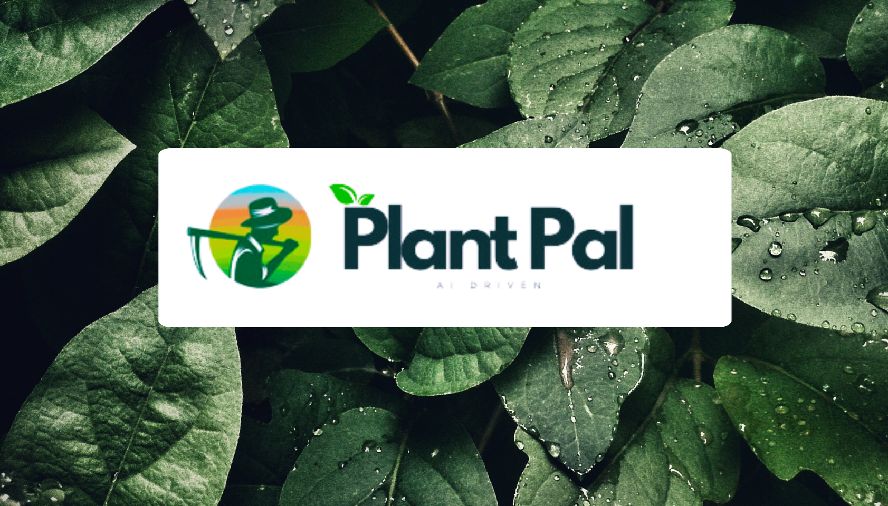
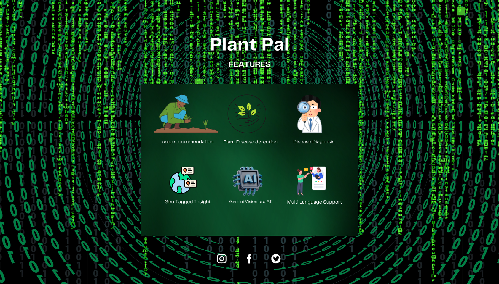
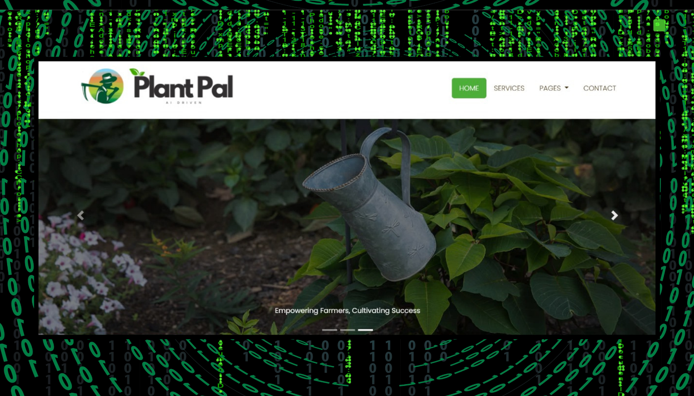

# 🌱 **Plant-Pal: Revolutionizing Plant Care for Farmers** 🌾

<p align="center">
  
</p>

---

## 🚀 **About Plant-Pal**

Plant-Pal is your ultimate farming assistant! Designed to empower farmers with cutting-edge technology, it:

- **🔍 Detects plant diseases** with unparalleled accuracy.
- **💊 Offers precise treatment recommendations.**
- **🌾 Suggests optimal crops** for sustainable growth.
- **🌍 Supports multiple languages**, tailored for every farmer.

---

## 🌟 **Key Features**

### 🌍 **Multi-Language Support**
Communicate effortlessly in **your native language** and make farming insights accessible to all.

### 📸 **Intelligent Disease Detection**
1. **Snap a photo** of your plant.
2. Plant-Pal **processes the image automatically** for compatibility.
3. **Gemini Vision Pro AI** analyzes the image to detect plant diseases with unmatched efficiency.

### 💡 **Smart Crop Recommendations**
Using your input, Plant-Pal suggests the most suitable crops to grow, ensuring maximum yield and soil sustainability.

### ⚡ **Lightweight Yet Powerful**
- Built with **Streamlit**, ensuring a sleek, responsive app experience.
- Powered by **Troboflow Cloud Inference** and **Gemini Vision Pro**, keeping the app fast and efficient.

---

## 💻 **Technology Stack**

| **Component**              | **Technology**             |
|----------------------------|----------------------------|
| **Disease Detection**      | Gemini Vision Pro API      |
| **Backend Framework**      | Streamlit                  |
| **Cloud Inference Model**  | Troboflow                  |
| **Programming Language**   | Python                     |
| **Frontend**               | Streamlit UI               |

---

## 🔬 **Why Choose Plant-Pal?**

### 🌟 **Efficiency at Its Best**
By offloading heavy ML tasks to **Gemini Vision Pro** and **Troboflow**, Plant-Pal ensures a lightweight app that doesn’t compromise on power.

### 🌟 **Accurate & Reliable**
Our AI models are fine-tuned to deliver **highly accurate results** in detecting diseases and recommending solutions.

### 🌟 **Farmer-Centric Design**
- **Simple to use**, even for non-technical users.
- **Fast and responsive**, perfect for real-world farming scenarios.

---

## 🔧 **Setup Instructions**

Follow these steps to get Plant-Pal running on your system:

1. **Clone the Repository:**
   ```bash
   git clone https://github.com/sanjayjr8/Plant-Pal.git
   ```

2. **Navigate to the Project Directory:**
   ```bash
   cd Plant-Pal
   ```

3. **Install Dependencies:**
   ```bash
   pip install -r requirements.txt
   ```

4. **Run the Application:**
   ```bash
   streamlit run app.py
   ```

---

## 📸 **Features**

<p align="center">
  
  
  
</p>

---

## 🤝 **Contributing**

We welcome contributions from everyone! To contribute:

1. **Fork this repository.**
2. **Create a feature branch:**
   ```bash
   git checkout -b feature-name
   ```
3. **Commit your changes and open a pull request.**

---

## 📜 **License**

This project is licensed under the **MIT License**. See the [LICENSE](LICENSE) file for more information.

---

## 📧 **Contact**

For inquiries or suggestions, feel free to reach out:
 
- **Author**: Sanjay J | Miruthula Sk | Rohith
- **Email**: [sanjayjayachandran08@gmail.com](mailto:sanjayjayachandran08@gmail.com)

---

## Contributors

<table>
  <tr>
    <td align="center">
      <a href="https://github.com/Rohithselvan">
        
        <br />
        <sub><b>Rohith</b></sub>
      </a>
      <br />
      Role/Contribution
    </td>
  </tr>
</table>


<p align="center">
  <b>🌟 Don’t forget to give a star if you find this project helpful! 🌟</b>
</p>
